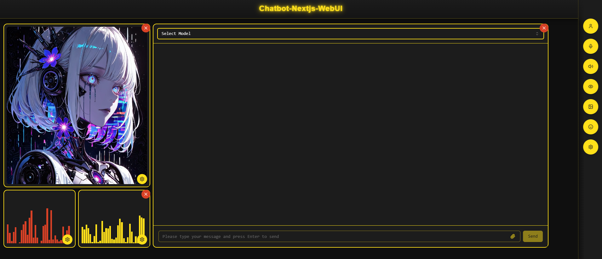

# 💬 chatbot-nextjs-webui 💬

## About
**Chatbot-nextjs-webui** is a sleek, responsive frontend for interacting with powerful local agents. It supports natural language chat, speech-to-text, text-to-speech, image generation, vision tasks, and more — all wrapped in a modern Next.js interface.

## Screenshots

*The main interface featuring draggable components, audio visualization, anime-style avatar, and the animated starfish triangle background*

Rendering features include:
- Darcula-style markdown code blocks
- Mermaid diagrams
- LaTeX formulas
- HTML with embedded JavaScript

Just type prompts like:

- "please use LaTeX to explain..."
- "please code me a Python script for a transformers chatbot that..."
- "please create a mermaid chart for..."
- "please create an HTML app with embedded JavaScript that..."

## Features
- 🖥️ **Modern UI** made using Next.js 14 & shadcn/ui with custom theming
- 🎨 **Draggable Dashboard** with resizable components and magnetic grid layout
- 🌟 **Animated Background** featuring slow-growing starfish patterns on triangle tessellation
- 💬 **Real-time Chat** interface with streaming responses and markdown rendering
- � **Audio Visualization** with dual-channel waveform display (user/AI)
- 🎭 **Add your own Anime-style Avatars** integration with customizable character display
- 👁️ **Vision Models** support for various image analysis tasks
- 🎙️ **Speech Integration** using WhisperSTT and VibeVoiceTTS
- � **Responsive Design** with rust-orange and banana-yellow color scheme

## Prerequisites
- Node.js 18+
- Chatbot-python-core API Server
- Ollama

# Installation
1. Step one, clone [chatbot-python-core](https://github.com/xXSup3rN0v4Xx/chatbot-python-core) and follow its installation instructions carefully including installing its dependecies.
```bash
# In a seperate directory clone the chatbot-core
git clone https://github.com/xXSup3rN0v4Xx/chatbot-core.git
```

2. Step two, clone the webui [chatbot-nextjs-webui](https://github.com/xXSup3rN0v4Xx/chatbot-nextjs-webui) and follow the installation instructions carefully.

```bash
git clone https://github.com/xXSup3rN0v4Xx/chatbot-nextjs-webui.git
```

3. Step three, install the webui dependencies
```bash
cd chatbot-next
npm install
```

4. Step 4, start the development server to start using your local chatbot
```bash
npm run dev
```
