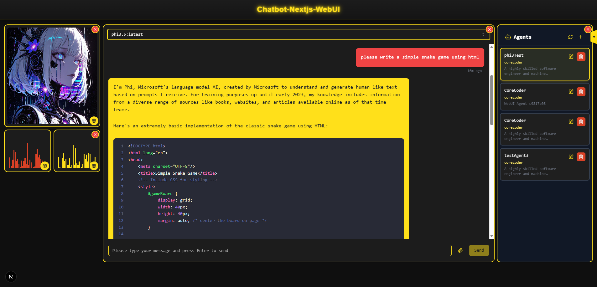
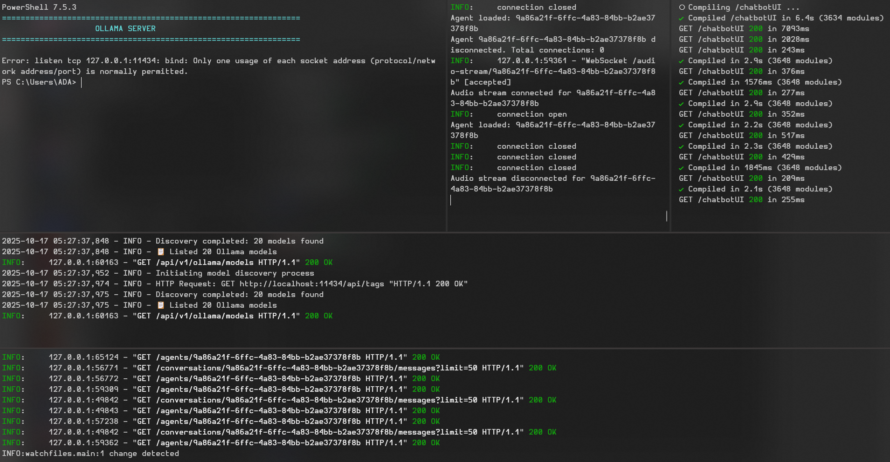

# 💬 chatbot-nextjs-webui 💬

## About
**Chatbot-nextjs-webui** is a sleek, responsive frontend for interacting with powerful local agents. It supports natural language chat, speech-to-text, text-to-speech, image generation, vision tasks, and more — all wrapped in a modern Next.js interface.

**🚀 NEW: Full-Stack Integration Setup!** This repository now includes scripts to run the complete AI chatbot stack with Chatbot-Python-Core and Multimodal-DB.

## Screenshots

*The main interface featuring draggable components, audio visualization, anime-style avatar, and the animated starfish triangle background*


*The api split terminal interface showcasing the different backend api routes*

Rendering features include:
- Darcula-style markdown code blocks
- Mermaid diagrams
- LaTeX formulas
- HTML with embedded JavaScript

Just type prompts like:

- "please use LaTeX to explain..."
- "please code me a Python script for a transformers chatbot that..."
- "please create a mermaid chart for..."
- "please create an HTML app with embedded JavaScript that..."

## Features
- 🖥️ **Modern UI** made using Next.js 14 & shadcn/ui with custom theming
- 🎨 **Draggable Dashboard** with resizable components and magnetic grid layout
- 🌟 **Animated Background** featuring slow-growing starfish patterns on triangle tessellation
- 💬 **Real-time Chat** interface with streaming responses and markdown rendering
- 🎵 **Audio Visualization** with dual-channel waveform display (user/AI)
- 🎭 **Add your own Anime-style Avatars** integration with customizable character display
- 👁️ **Vision Models** support for various image analysis tasks (YOLO)
- 🎙️ **Speech Integration** using Whisper STT and Kokoro/VibeVoice/F5 TTS
- 🎨 **Image Generation** with SDXL support
- 📊 **Responsive Design** with rust-orange and banana-yellow color scheme

## 🚀 Quick Start (Full Stack)

### Option 1: Complete Setup (Recommended for First-Time Users)

If you want to run the **entire AI chatbot stack** including Python backends:

```powershell
# Clone all three repositories in the same parent folder:
git clone https://github.com/xXSup3rN0v4Xx/chatbot-nextjs-webui.git
git clone https://github.com/xXSup3rN0v4Xx/chatbot-python-core.git
git clone https://github.com/xXSup3rN0v4Xx/multimodal-db.git

# Setup Python environments (first time only)
cd chatbot-nextjs-webui\scripts
.\setup_python_environments.ps1

# Start all services
.\start_all_services.ps1

# Open http://localhost:3000 in your browser
```

That's it! 🎉 The scripts will:
- ✅ Create Python virtual environments
- ✅ Install all dependencies
- ✅ Start Ollama
- ✅ Start Chatbot-Python-Core (port 8000)
- ✅ Start Multimodal-DB (port 8001)  
- ✅ Start WebSocket Bridge (port 2020)
- ✅ Start Next.js WebUI (port 3000)

### Option 2: Frontend Only

If you already have backend services running:

```bash
cd chatbot-next
npm install
npm run dev
```

Then open http://localhost:3000

## Prerequisites
- **Node.js 18+** - For Next.js frontend
- **Python 3.10+** - For backend services (if using full stack)
- **Ollama** - For LLM execution
- **Windows** - PowerShell scripts (adaptable to Linux/Mac)

## 📁 Project Structure

```
chatbot-nextjs-webui/
├── chatbot-next/                    # Next.js application
│   ├── src/
│   │   ├── components/              # React components
│   │   │   ├── SpeechRecognition/  # NEW: Microphone recording
│   │   │   ├── TextToSpeech/       # NEW: Audio playback
│   │   │   ├── VisionDetection/    # NEW: YOLO integration
│   │   │   ├── ImageGeneration/    # NEW: SDXL integration
│   │   │   └── ...
│   │   └── app/
│   └── package.json
├── docs/                            # Documentation
│   ├── FULLSTACK_SETUP_GUIDE.md    # Complete integration guide
│   ├── QUICKSTART_COMPONENTS.md    # Component usage guide
│   ├── FRONTEND_COMPONENTS_GUIDE.md # Detailed component docs
│   └── CHANGES_SUMMARY.md          # Recent updates
├── scripts/                         # Automation scripts
│   ├── setup_python_environments.ps1 # Setup Python backends
│   └── start_all_services.ps1       # Start all services
└── README.md                        # This file
```

## 📚 Documentation

- **[FULLSTACK_SETUP_GUIDE.md](docs/FULLSTACK_SETUP_GUIDE.md)** - Complete setup and architecture
- **[QUICKSTART_COMPONENTS.md](docs/QUICKSTART_COMPONENTS.md)** - Quick component integration
- **[FRONTEND_COMPONENTS_GUIDE.md](docs/FRONTEND_COMPONENTS_GUIDE.md)** - Detailed component API

## 🎯 What Each Service Does

| Service | Port | Purpose |
|---------|------|---------|
| **Next.js WebUI** | 3000 | Frontend interface |
| **WebSocket Bridge** | 2020 | Connects frontend to backends |
| **Chatbot-Python-Core** | 8000 | AI execution (Ollama, YOLO, Whisper, etc.) |
| **Multimodal-DB** | 8001 | Storage, memory, RAG, analytics |
| **Ollama** | 11434 | LLM backend |

## 🛠️ Development

### Installing Frontend Dependencies
```bash
cd chatbot-next
npm install
```

### Running Development Server
```bash
npm run dev
```

### Building for Production
```bash
npm run build
npm start
```

## 🔧 Troubleshooting

### WebSocket Connection Issues
```powershell
# Check if bridge is running
curl http://localhost:2020/health
```

### Python Services Not Starting
```powershell
# Make sure you ran the setup script
cd scripts
.\setup_python_environments.ps1
```

### Port Conflicts
```powershell
# Find what's using a port
netstat -ano | findstr :3000

# Kill process
taskkill /F /PID <PID>
```

## 🤝 Related Projects

This WebUI integrates with:
- [chatbot-python-core](https://github.com/xXSup3rN0v4Xx/chatbot-python-core) - AI model execution
- [multimodal-db](https://github.com/xXSup3rN0v4Xx/multimodal-db) - Database and storage

## 🆕 Recent Updates

### v2.0.0 - Full Stack Integration (October 2025)
- ✅ Added full-stack setup scripts
- ✅ Created SpeechRecognition component
- ✅ Created TextToSpeech component
- ✅ Created VisionDetection component
- ✅ Created ImageGeneration component
- ✅ WebSocket bridge integration
- ✅ Comprehensive documentation

See [CHANGES_SUMMARY.md](docs/CHANGES_SUMMARY.md) for complete details.

## 📝 License

See LICENSE file in this directory.

## 🎉 Credits

Built with:
- Next.js + React
- shadcn/ui components
- FastAPI (Python backends)
- Ollama (LLMs)
- YOLO (Object Detection)
- Whisper (Speech Recognition)
- Kokoro/VibeVoice/F5 (Text-to-Speech)
- SDXL (Image Generation)
- And many more amazing open-source tools!

---

**Ready to build something amazing?** Start with the [Quick Start](#-quick-start-full-stack) guide above! 🚀
